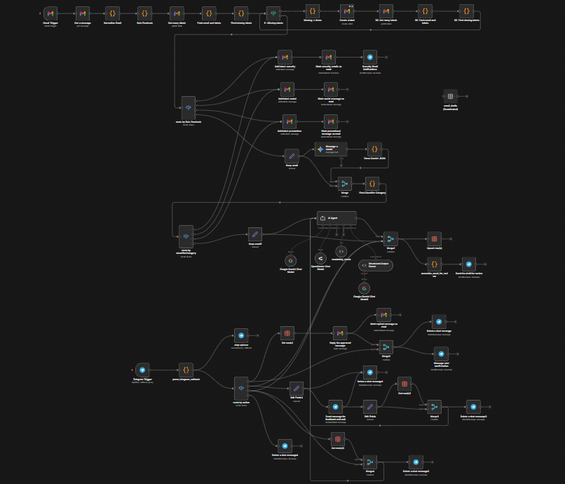

# 📧 Intelligent AI Email Assistant

An agentic, human-in-the-loop email automation system that intelligently processes, classifies, and drafts responses for your Gmail inbox. Built on **n8n**, powered by **Google Gemini**, and controlled via **Telegram**.

---

## ⚡ Core Capabilities

### 🛡️ Smart Triage & Classification
Every incoming email is analyzed using a multi-stage classification process:
*   **Security**: Real-time identification of login alerts, OTPs, and account warnings.
*   **Social**: Automated filtering of social media notifications and digests.
*   **Promotions**: Intelligent detection of marketing materials and newsletters.
*   **Reply**: Precise isolation of emails requiring authentic human interaction.

### 🧠 Agentic Email Drafting
For actionable emails, the system doesn't just "write a reply"—it reasons through the context:
*   **Context-Aware**: Adapts tone and content based on historical context and sender intent.
*   **Hallucination Protection**: Explicitly avoids making false commitments or inventing facts.
*   **Structured Output**: Generates subject lines, draft bodies, key points, and clarifying questions.

### 📝 Automated Readability Loop
Ensures every communication is clear and professional using an integrated **Flesch Reading Ease** feedback loop. If a draft is too complex, the AI autonomously revises it until the readability score meets professional standards.

### 🤝 Human-in-the-Loop Approval
**Safety is paramount.** No email is sent without your explicit consent via a sleek Telegram interface:
*   **Approve & Send**: One-tap delivery of the polished draft.
*   **Edit**: Provide natural language feedback to the AI for instant revisions.
*   **Improve More**: Ask the AI to further refine the draft's tone and clarity.
*   **Decline**: Stop the workflow for unwanted or irrelevant emails.

---

## 📊 Complete Workflow

Below is the conceptual architecture of how your emails are handled from arrival to action.

### The Lifecycle of an Email
1.  **Ingestion**: Triggered by new arrivals in Gmail.
2.  **Normalization**: Custom JavaScript parses headers and body content for signals.
3.  **Triage**: Rule-based pre-checks followed by LLM-powered classification.
4.  **Routing**: Automated labeling based on category (Security, Social, etc.).
5.  **Agentic Drafting**: LangChain-integrated AI agent generates a structured response.
6.  **Readability Filter**: Automated loops optimize the draft for clarity.
7.  **Review Loop**: Human review via Telegram Bot buttons.
8.  **Execution**: Automated Gmail actions (Send, Label, Mark as Read).

---

## 🛠️ Technical Stack

| Component | Technology |
| :--- | :--- |
| **Automation Engine** | [n8n](https://n8n.io/) (Self-hosted or Cloud) |
| **Brain (LLM)** | [Google Gemini 2.5 Flash](https://aistudio.google.com/) |
| **Agent Framework** | LangChain (via n8n) |
| **Human Interface** | Telegram Bot API |
| **Data Persistence** | n8n Internal Data Tables |
| **Communication** | Gmail API (OAuth2) |
| **Tunneling** | ngrok (for local development) |

---

## 🎯 Use Cases

*   **Executive Productivity**: Managed inbox filtering with human-approved responses.
*   **Founder/CEO Support**: Automated handling of routine inquiries while maintaining personal touch.
*   **Customer Support Triage**: Pre-processing support tickets before they reach your primary helpdesk.
*   **Personal Security**: Instant Telegram notifications for critical account alerts.

---

## 🔒 Safety & Ethics

*   **Zero Autonomous Sending**: The system is architected to require human approval for all outgoing communications.
*   **Data Privacy**: Designed to run on self-hosted infrastructure, keeping your email data under your control.
*   **Transparent Reasoning**: Every classification includes the AI's "reasoning" for full auditability.

---

## 👨‍💻 Author

**Milon Mahmud**
*AI Automation Engineer • AI/ML Researcher*

---

> [!TIP]
> This system is modular. You can easily extend it to support WhatsApp, Slack, or CRMs like Salesforce and HubSpot.